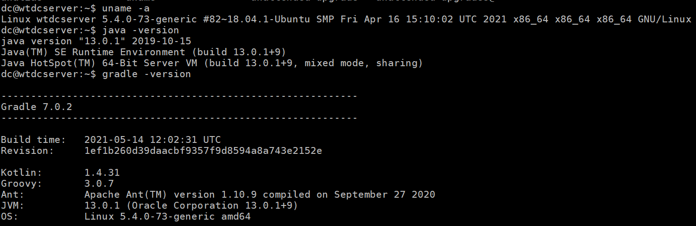
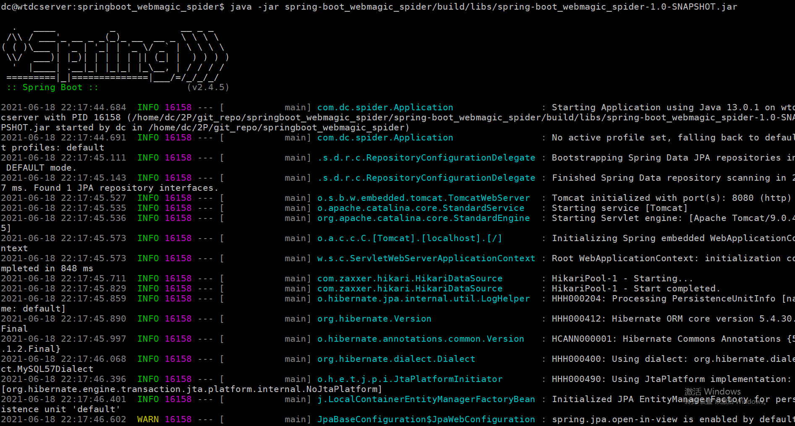

# spring-boot_webmagic_spider

Gradle spring-boot webmagic search baidu keywords,save the result to database

[](https://github.com/RichardLitt/springboot_webmagic_spider)


## Table of Contents

- [Background](#background)
- [Install](#install)
- [Usage](#usage)
	- [Generator](#generator)
- [Badge](#badge)
- [Example Readmes](#example-readmes)
- [Related Efforts](#related-efforts)
- [Maintainers](#maintainers)
- [Contributing](#contributing)
- [License](#license)

## Background


## Install

1. Enviroment
```sh
$ uname -a
Linux wtdcserver 5.4.0-73-generic #82~18.04.1-Ubuntu SMP Fri Apr 16 15:10:02 UTC 2021 x86_64 x86_64 x86_64 GNU/Linux

$ java -version

java version "13.0.1" 2019-10-15
Java(TM) SE Runtime Environment (build 13.0.1+9)
Java HotSpot(TM) 64-Bit Server VM (build 13.0.1+9, mixed mode, sharing)

$ gradle -version
------------------------------------------------------------
Gradle 7.0.2
------------------------------------------------------------

Build time:   2021-05-14 12:02:31 UTC
Revision:     1ef1b260d39daacbf9357f9d8594a8a743e2152e

Kotlin:       1.4.31
Groovy:       3.0.7
Ant:          Apache Ant(TM) version 1.10.9 compiled on September 27 2020
JVM:          13.0.1 (Oracle Corporation 13.0.1+9)
OS:           Linux 5.4.0-73-generic amd64
```


2. Clone code and change directories

```sh
$ git clone https://gitee.com/dc-melo/springboot_webmagic_spider.git
OR
$ git clone https://github.com/DC-Melo/springboot_webmagic_spider.git
$ cd springboot_webmagic_spider
```
3. use gradle to build project

```sh
$ ./gradlew build
```
check the output jar: spring-boot_webmagic_spider/build/libs/spring-boot_webmagic_spider-1.0-SNAPSHOT.jar


## Usage

run the output jar

```sh
$ java -jar spring-boot_webmagic_spider/build/libs/spring-boot_webmagic_spider-1.0-SNAPSHOT.jar 
```



### Generator

To use the generator, look at [generator-springboot_webmagic_spider](https://github.com/RichardLitt/generator-springboot_webmagic_spider). There is a global executable to run the generator in that package, aliased as `springboot_webmagic_spider`.

## Badge

If your README is compliant with Standard-Readme and you're on GitHub, it would be great if you could add the badge. This allows people to link back to this Spec, and helps adoption of the README. The badge is **not required**.

[](https://github.com/RichardLitt/springboot_webmagic_spider)

To add in Markdown format, use this code:

```
[](https://github.com/RichardLitt/springboot_webmagic_spider)
```

## Example Readmes

To see how the specification has been applied, see the [example-readmes](example-readmes/).

## Related Efforts

- [Art of Readme](https://github.com/noffle/art-of-readme) - 💌 Learn the art of writing quality READMEs.
- [open-source-template](https://github.com/davidbgk/open-source-template/) - A README template to encourage open-source contributions.

## Maintainers

[@DC-Melo](https://github.com/DC-Melo)
[@DC-Melo](https://gitee.com/DC-Melo)

## Contributing

Feel free to dive in! [Open an issue](https://github.com/DC-Melo/springboot_webmagic_spider/issues/new) or submit PRs.

Standard Readme follows the [Contributor Covenant](http://contributor-covenant.org/version/1/3/0/) Code of Conduct.

### Contributors

This project exists thanks to all the people who contribute. 
<a href="https://github.com/RichardLitt/springboot_webmagic_spider/graphs/contributors"></a>


## License

[MIT](LICENSE) © DC-Melo王江
